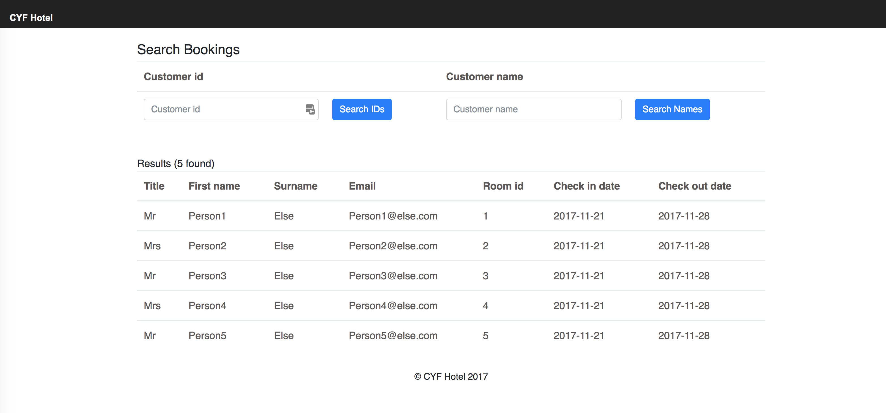

A hotel booking application in React. Homework for the [CodeYourFuture React module](https://codeyourfuture.github.io/syllabus-master/react/)

# Installation

1. Follow [the instructions](https://codeyourfuture.github.io/syllabus-master/others/making-a-pull-request.html#how-to-fork-a-github-repo) to fork & clone the GitHub repo
2. Install the dependencies by running `npm install`
3. Launch the server using `npm start`
4. It should automatically open `http://localhost:3000/` in your browser

# Exercises

## Lesson 1

You can find all of the tasks for Lesson 1 [here](../week-1/1-project/project-work.md)

## Lesson 2

You can find all of the tasks for Lesson 2 [here](../week-2/1-project/project-work.md)

## Lesson 3

You can find all of the tasks for Lesson 3 [here](../week-2/1-project/project-work.md)
